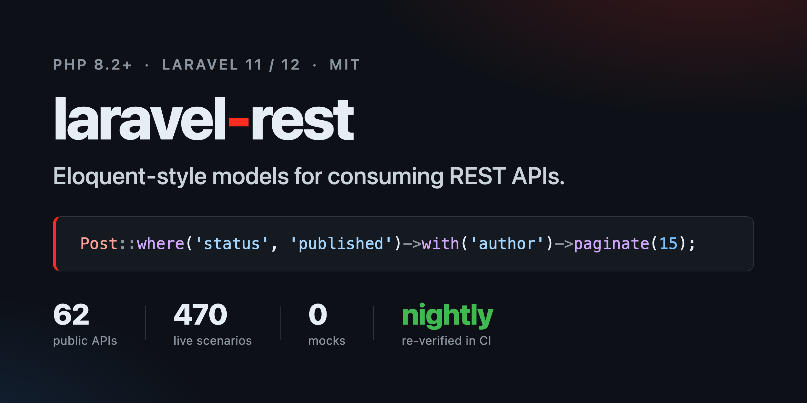

# Laravel Rest




Eloquent-like models and collections for consuming REST APIs.

Define a model, point it at an endpoint, and work with remote resources the way
you work with Eloquent: `User::get()`, `User::get($id)`, `User::post([...])`,
`$user->put()`, `User::delete($id)`.

```php
class Post extends Model
{
    protected ?string $endpoint = 'posts';

    public function author(): BelongsTo
    {
        return $this->belongsTo(User::class, 'user_id');
    }
}

Post::where('status', 'published')->orderBy('created_at')->with('author')->paginate(15);
```

No request class per endpoint, no DTO per response — one model per resource, and
the query builder writes the URLs. Every feature is verified against **62 real
public APIs** with 470 scenarios, so the awkward shapes (totals in headers,
cursor pagination, errors inside HTTP 200) are documented rather than
discovered in production — see [Live Verification](docs/live-verification.md).

## Table of Contents

- [Requirements](#requirements) · [Installation](#installation) · [Quick Start](#quick-start)
- [Configuration](#configuration) · [Defining Models](#defining-models)
- [Error Handling](#error-handling) · [Pagination](#pagination)
- [Query Builder](#query-builder)
- [Adapting to API Conventions](#adapting-to-api-conventions) — parameter
  [names](#1-renaming-parameters), [sort styles](#2-sort-styles),
  [filter styles](#3-filter-styles), [presets](#4-presets),
  [casing](#5-field-casing), [headers](#6-dynamic-headers),
  [error keys](#7-configuring-the-errors-key), [PATCH](#8-patch-updates),
  [envelopes](#9-request-envelopes), [standalone](#10-standalone-resolver--setting-query-config),
  [all together](#11-putting-it-all-together)
- [Caching](#caching) · [Relations](#relations)
- [Authentication](#authentication) · [Retry](#retry) · [Model Events](#model-events)
- [Testing Your Application](#testing-your-application) · [Usage Outside Laravel](#usage-outside-laravel)
- [Capability Matrix](#capability-matrix) · [Upgrading](#upgrading) · [Contributing](#contributing)

## Requirements

- PHP 8.2+
- Laravel 11 or 12

> [!NOTE]
> Laravel 11 reached end of life in 2026 (no more security fixes). The package
> still supports and tests it, but new projects should target Laravel 12.

## Installation

```bash
composer require sanchescom/laravel-rest
```

The service provider is registered automatically via package auto-discovery —
no manual registration needed.

## Quick Start

A model is a class pointed at an endpoint. Everything below runs for real
against [JSONPlaceholder](https://jsonplaceholder.typicode.com):

```php
<?php

use Sanchescom\Rest\Model;

class Post extends Model
{
    // endpoint is inferred from the class name: "posts"
    protected array $casts = ['id' => 'int', 'userId' => 'int'];
}
```

```php
// config/rest.php
'clients' => [
    'placeholder' => [
        'provider' => 'guzzle',
        'base_uri' => 'https://jsonplaceholder.typicode.com/',
    ],
],
```

```php
$post  = Post::get(1);                  // GET posts/1        -> Post
$posts = Post::get();                   // GET posts          -> Collection<Post>
$mine  = $posts->where('userId', 1);    // in-memory collection filter (server-side: see Query Builder)
$page  = $posts->paginate(10);          // LengthAwarePaginator

$some  = Post::getMany([3, 1, 2]);      // concurrent requests, results in [3, 1, 2] order

$new   = Post::post(['title' => 'Hi', 'userId' => 1]);   // POST posts
$upd   = Post::put(1, ['title' => 'Updated']);           // PUT posts/1
Post::delete(1);                                          // DELETE posts/1

// ...or update/delete through an instance using its own primary key:
$post = Post::get(2);
$post->title = 'Changed';
$post->put();                           // PUT posts/2
$post->delete();                        // DELETE posts/2

Post::get(987654);                      // 404 -> throws ModelNotFoundException
```

## Configuration

Publish the config file:

```bash
php artisan vendor:publish --tag=rest-config
```

Configure one or more clients in `config/rest.php`:

```php
<?php

return [
    'default' => env('REST_CLIENT', 'localhost'),

    'clients' => [
        'localhost' => [
            'provider' => 'guzzle',
            'base_uri' => 'https://localhost/',
            'options' => [
                'headers' => [
                    'Accept' => 'application/json',
                ],
            ],
        ],
        'billing' => [
            'provider' => 'guzzle',
            'base_uri' => 'https://billing.example.com/api/',
            'options' => [
                'headers' => [
                    'Authorization' => 'Bearer '.env('BILLING_TOKEN'),
                ],
            ],
        ],
    ],
];
```

> [!NOTE]
> `base_uri` must end with a trailing slash, and endpoints must not
> start with one — that is how Guzzle resolves relative URIs.

## Defining Models

```php
<?php

use Sanchescom\Rest\Model;

class User extends Model
{
    /** Client name from config/rest.php; null uses the default client. */
    protected ?string $client = null;

    /** Endpoint; defaults to the snake-cased plural of the class name ("users"). */
    protected ?string $endpoint = 'users';

    /** Key that wraps payloads in responses (e.g. {"data": ...}); null for bare payloads. */
    protected ?string $dataKey = 'data';

    /** Whitelist of fillable attributes; empty array allows everything. */
    protected array $fillable = ['id', 'first_name', 'last_name', 'email'];

    /** Attribute casts applied on read: int|float|bool|string. */
    protected array $casts = ['id' => 'int'];

    /** Per-model HTTP client options merged over the configured ones. */
    protected array $options = [];
}
```

## Error Handling

Every 4xx/5xx response throws a typed exception; you never get a silent null:

| Status | Exception |
| --- | --- |
| 404 | `Sanchescom\Rest\Exceptions\ModelNotFoundException` |
| 422 | `Sanchescom\Rest\Exceptions\ValidationException` (`->errors()`) |
| 500+ | `Sanchescom\Rest\Exceptions\ServerException` |
| other 4xx | `Sanchescom\Rest\Exceptions\RequestException` |

All of them extend `Sanchescom\Rest\Exceptions\RestException` and expose the
request context: `$e->uri`, `$e->status`, `$e->body`.

```php
use Sanchescom\Rest\Exceptions\ValidationException;

try {
    User::post(['email' => 'not-an-email']);
} catch (ValidationException $e) {
    $errors = $e->errors();
}
```

## Pagination

### Server-side

`paginate()` requests one page and builds a `LengthAwarePaginator` from the
response metadata; `simplePaginate()` returns a `Paginator` for APIs that do
not report a total.

```php
$posts = Post::where('status', 'active')->paginate(15);        // page from ?page=
$posts = Post::orderBy('id')->simplePaginate(15, 'p', 3);      // explicit page name and page
```

Tell the client where the metadata lives — a preset or explicit dot paths:

```php
'clients' => [
    'crm' => [
        'base_uri'   => 'https://crm.example.com/api/',
        'pagination' => 'laravel',   // total: meta.total, next: links.next
        // 'pagination' => 'django',  // total: count,      next: next
        // 'pagination' => 'jsonapi', //                    next: links.next
        // 'pagination' => [
        //     'style'    => 'offset',          // 'page' (default) or 'offset'
        //     'total'    => 'meta.count',
        //     'has_more' => 'meta.has_more',   // alternative to 'next'
        // ],
    ],
],
```

A model can override the client with `protected array|string|null $pagination`.
Items are read through `$dataKey` as usual, and page parameter names follow the
client's `query` conventions (e.g. `page[number]`, `page_size`).

- `paginate()` requires a `total` path and throws `RestException` when it is
  not configured or missing from the response.
- `simplePaginate()` uses `next`, then `has_more` (strict `true`); `next` takes
  precedence when both are configured, and an explicit `'next' => null` clears
  a preset's `next` path so `has_more` applies. With neither configured it
  assumes more pages when a full page came back — an exactly-full last page
  then shows one extra empty page, and a server that caps the page size below
  `perPage` stops reporting more pages after page one.
- Both replace any earlier `page()` / `limit()` / `offset()` on the query.
- Enveloped responses (the `laravel` and `django` presets) need the model's
  `$dataKey` (e.g. `'data'`, `'results'`) to find the items; without it the
  whole response body is hydrated as items.
- Under `Rest::fake()` the pagination config is kept, but query conventions
  are not, so faked requests send plain `page` / `limit` / `offset` names —
  write `assertSent` expectations accordingly.

### Iterating all pages

`lazy()` returns a `LazyCollection` that requests one page at a time (100
models per request by default) and stops on an empty page or when the
pagination metadata reports no more pages — the same rules as
`simplePaginate()`. Nothing is requested until you iterate, and iterating
again repeats the requests.

```php
foreach (Post::where('status', 'active')->lazy() as $post) {
    // ...
}

// Mirror an API resource into a local table
Post::lazy(50)->chunk(500)->each(
    fn ($posts) => DbPost::upsert($posts->map->toArray()->values()->all(), ['id']),
);
```

Keep the chunk size at or below the API's maximum page size: without `next`
or `has_more` configured, a short page ends the iteration. If the API ignores
the page parameter and sends the same page again, `lazy()` throws a
`RestException` instead of looping forever.

### In memory

```php
$paginator = User::get()->paginate(15); // slices an already-fetched collection
```

## Query Builder

Filter, sort, and paginate without writing query strings by hand.

> [!IMPORTANT]
> `Post::where(...)->get()` filters **on the server** — the conditions are
> compiled into the query string and the API returns only matching records.
> `Post::get()->where(...)` filters the **already-loaded collection in
> memory** — it fetches everything first. For anything beyond trivial
> datasets, prefer the builder form.

```php
// Plain grammar (default) — ?status=active&sort=-created_at&limit=20
$posts = Post::where('status', 'active')
    ->orderBy('created_at', 'desc')
    ->limit(20)
    ->get();

// Pagination
Post::page(2)->limit(15)->get();   // ?page=2&limit=15
Post::offset(30)->limit(15)->get(); // ?offset=30&limit=15

// Extra / non-standard params
Post::withQuery(['include' => 'author'])->get();

// Membership filter — ?status=draft,review (rendered per grammar)
Post::whereIn('status', ['draft', 'review'])->get();
// whereIn('status', []) sends an empty filter (status=) — guard empty lists yourself

// Convenience
Post::where('status', 'draft')->first(); // first item of the collection
Post::where('userId', 1)->count();       // count of matching items
```

**Other query conventions (JSON:API, Django, custom names)** — the preferred
way is a one-word preset or a small config array on the client; see
[Adapting to API Conventions](#adapting-to-api-conventions):

```php
'clients' => [
    'myapi' => [
        'provider' => 'guzzle',
        'base_uri' => 'https://api.example.com/',
        'query'    => 'jsonapi',   // filter[field]=..., page[size]=..., page[number]=...
    ],
],
```

For a truly custom query language, implement `Sanchescom\Rest\Query\Grammar`
yourself and register the class per client (`'grammar' => MyGrammar::class`)
or per model (`protected ?string $grammar = MyGrammar::class`). A grammar
class always takes precedence over the `'query'` config.

## Adapting to API Conventions

Every REST API names its parameters differently. Some call it `page_size`,
others call it `page[size]`. Some prefix descending sorts with `-`, others
append `:desc`. The `'query'` key in any client config covers all of these
without touching the calling code. For truly exotic conventions, implement
`Sanchescom\Rest\Query\Grammar` (or `AuthInterface` / `ClientInterface`) — but
in the common case a config array is all you need.

### 1. Renaming Parameters

The `names` map translates the library's canonical parameter names (`limit`,
`offset`, `page`, `sort`) to whatever the API expects. Dot notation in the
value produces a nested array that Guzzle serialises as `param[sub]`:

```php
// config/rest.php
'clients' => [
    'catalog' => [
        'provider' => 'guzzle',
        'base_uri'  => 'https://api.example.com/v2/',
        'query' => [
            'names' => [
                'limit'  => 'page.size',    // page[size]=...
                'page'   => 'page.number',  // page[number]=...
                'offset' => 'page.offset',  // page[offset]=...
            ],
        ],
    ],
],
```

```php
Article::page(2)->limit(25)->get();
// GET articles?page[size]=25&page[number]=2
```

### 2. Sort Styles

Four styles are available. Pick the one that matches your API:

**`dash` (default)** — prefix descending fields with `-`, comma-separate:

```php
'query' => ['sort' => 'dash'],
```

```php
Product::orderBy('price', 'desc')->orderBy('name')->get();
// GET products?sort=-price,name
```

**`suffix`** — append a separator (default `:`) followed by the direction:

```php
'query' => ['sort' => 'suffix'],              // uses ':' separator
'query' => ['sort' => 'suffix', 'sort_suffix' => '|'],  // custom separator
```

```php
Product::orderBy('price', 'desc')->orderBy('name')->get();
// GET products?sort=price:desc,name:asc
// (or price|desc,name|asc with the custom separator)
```

**`separate`** — two distinct parameters for field and direction (only the
**first** `orderBy` is sent; additional calls are ignored). When `sort_names` is
omitted, defaults are: field param `sort`, direction param `direction`:

```php
'query' => [
    'sort'       => 'separate',
    'sort_names' => ['field' => 'sort_by', 'direction' => 'sort_dir'],
],
```

```php
Product::orderBy('price', 'desc')->get();
// GET products?sort_by=price&sort_dir=desc
```

**`array`** — an associative array keyed by field name:

```php
'query' => ['sort' => 'array'],
```

```php
Product::orderBy('price', 'desc')->orderBy('name')->get();
// GET products?sort[price]=desc&sort[name]=asc
```

### 3. Filter Styles

Three filter styles cover the most common conventions. The operator (third
argument of `where()`) is an arbitrary string passed through to the API —
use whatever vocabulary your API defines (`gte`, `lte`, `like`, `in`, …):

**`plain` (default)** — bare equality, operator in brackets for everything else:

```php
'query' => ['filters' => 'plain'],
```

```php
Order::where('status', 'shipped')->where('total', 'gte', 100)->get();
// GET orders?status=shipped&total[gte]=100
```

**`brackets`** — JSON:API-style `filter[field]`:

```php
'query' => ['filters' => 'brackets'],
```

```php
Order::where('status', 'shipped')->where('total', 'gte', 100)->get();
// GET orders?filter[status]=shipped&filter[total][gte]=100
```

**`django`** — Django REST Framework style with double-underscore lookups:

```php
'query' => ['filters' => 'django'],
```

```php
Order::where('status', 'shipped')->where('total', 'gte', 100)->get();
// GET orders?status=shipped&total__gte=100
```

### 4. Presets

Two presets are built in. Pass a string to activate one:

```php
// JSON:API preset — brackets filters, dash sort, page[size]/page[number]/page[offset]
'query' => 'jsonapi',

// Django DRF preset — django filters, dash sort, ordering/page_size
'query' => 'django',
```

```php
// Preset with overrides — start from jsonapi and change just the sort style
'query' => [
    'preset' => 'jsonapi',
    'sort'   => 'suffix',
],
```

```php
// jsonapi preset in action
Article::where('published', true)->orderBy('created_at', 'desc')->page(2)->limit(15)->get();
// GET articles?filter[published]=true&sort=-created_at&page[size]=15&page[number]=2

// django preset in action
Article::where('published', true)->orderBy('created_at', 'desc')->limit(15)->get();
// GET articles?published=true&ordering=-created_at&page_size=15
```

### 5. Field Casing

The `casing` option normalises every field name that appears in `where()` and
`orderBy()` calls before it hits the wire. Useful when your PHP code uses
camelCase but the API expects snake_case:

```php
'query' => ['casing' => 'snake'],   // camel → snake
'query' => ['casing' => 'camel'],   // snake → camel
```

```php
// 'casing' => 'snake'
Report::where('reportDate', '2024-01-01')->orderBy('totalRevenue', 'desc')->get();
// GET reports?report_date=2024-01-01&sort=-total_revenue
```

### 6. Dynamic Headers

**Model-level headers** — always sent for every request from this model:

```php
class Tenant extends Model
{
    protected ?string $client   = 'platform';
    protected ?string $endpoint = 'tenants';

    /** @var array<string, string> */
    protected array $headers = [
        'X-Tenant-ID' => 'acme',
    ];
}

// GET tenants   (headers: X-Tenant-ID: acme)
Tenant::get();
```

**Per-chain `withHeaders()`** — merges over the model-level headers; chain
value wins on key conflicts:

```php
Tenant::withHeaders([
    'X-Tenant-ID'      => 'betacorp',   // overrides the model default
    'Accept-Language'  => 'fr-FR',
])->where('active', true)->get();
// GET tenants?active=true   (headers: X-Tenant-ID: betacorp, Accept-Language: fr-FR)
```

> [!NOTE]
> Under `Rest::fake()` the inline resolver ignores the `options`
> argument passed to `client()`, so headers are **not** forwarded to the fake.
> The fake sees bare requests with no custom headers. Similarly, the standalone
> `ClientResolver` ignores the `options` argument — wire headers directly
> into the `ClientInterface` instance you register instead.

### 7. Configuring the Errors Key

By default, `ValidationException::errors()` looks for the `'errors'` key in
the response body. Set `errors_key` (dot notation supported) to point at a
different location:

```php
'clients' => [
    'myapi' => [
        'provider'   => 'guzzle',
        'base_uri'   => 'https://api.example.com/',
        'errors_key' => 'meta.validation_errors',
    ],
],
```

```php
// Response body from the API:
// {
//   "message": "Unprocessable",
//   "meta": {
//     "validation_errors": {"email": ["already taken"]}
//   }
// }

try {
    User::post(['email' => 'taken@example.com']);
} catch (\Sanchescom\Rest\Exceptions\ValidationException $e) {
    $e->errors(); // ['email' => ['already taken']]
}
```

### 8. PATCH Updates

By default `put()` sends a `PUT` request. Switch to `PATCH` per client:

```php
'clients' => [
    'myapi' => [
        'provider'      => 'guzzle',
        'base_uri'      => 'https://api.example.com/',
        'update_method' => 'patch',
    ],
],
```

```php
User::put(42, ['email' => 'new@example.com']);
// PATCH users/42   {"email":"new@example.com"}
```

### 9. Request Envelopes

Some APIs require the POST/PUT body to be nested under a key:

```php
class Invoice extends Model
{
    protected ?string $endpoint       = 'invoices';
    protected ?string $requestDataKey = 'data';  // write envelope
    protected ?string $dataKey        = 'data';  // read unwrap key
}
```

```php
Invoice::post(['number' => 'INV-001', 'total' => 500]);
// POST invoices
// Body: {"data":{"number":"INV-001","total":500}}

Invoice::get(1);
// GET invoices/1
// Response: {"data":{"id":1,"number":"INV-001","total":500}}
// → Invoice with attributes {id:1, number:"INV-001", total:500}
```

> [!NOTE]
> `$requestDataKey` wraps **write** bodies (POST/PUT/PATCH).
> `$dataKey` unwraps **read** responses (GET). They are independent — you can
> set one without the other.

### 10. Standalone Resolver — Setting Query Config

Outside Laravel you can configure `ConfigurableGrammar` directly on
`ClientResolver` instead of relying on the config file:

```php
use Sanchescom\Rest\ClientResolver;
use Sanchescom\Rest\Clients\GuzzleClient;
use Sanchescom\Rest\Model;

$resolver = new ClientResolver;
$resolver->addClient('catalog', GuzzleClient::fromConfig([
    'base_uri' => 'https://api.example.com/',
]));
$resolver->setDefaultClient('catalog');
$resolver->setQueryConfig('catalog', 'jsonapi');   // preset string

Model::setClientResolver($resolver);

// Or with a full config array:
$resolver->setQueryConfig('catalog', [
    'preset' => 'jsonapi',
    'sort'   => 'suffix',
]);
```

### 11. Putting It All Together

A realistic client config combining several conventions, plus a model that uses
a write envelope:

```php
// config/rest.php
'clients' => [
    'commerce' => [
        'provider'      => 'guzzle',
        'base_uri'      => 'https://api.commerce.example/v3/',
        'update_method' => 'patch',
        'errors_key'    => 'errors.fields',
        'query' => [
            'preset'  => 'jsonapi',  // brackets filters, dash sort, page[size]/page[number]
            'sort'    => 'suffix',   // override sort to suffix style
            'casing'  => 'snake',    // normalise camelCase PHP fields to snake_case on the wire
        ],
        'auth' => [
            'driver' => 'bearer',
            'token'  => env('COMMERCE_TOKEN'),
        ],
    ],
],
```

```php
class Order extends Model
{
    protected ?string $client         = 'commerce';
    protected ?string $endpoint       = 'orders';
    protected ?string $dataKey        = 'data';
    protected ?string $requestDataKey = 'data';

    /** @var array<string, string> */
    protected array $headers = ['X-Store-ID' => 'eu-west-1'];
}
```

```php
// List — filters, sort, pagination, casing all applied automatically
Order::where('status', 'pending')
     ->where('totalAmount', 'gte', 50)
     ->orderBy('createdAt', 'desc')
     ->page(2)
     ->limit(20)
     ->get();
// GET orders?filter[status]=pending&filter[total_amount][gte]=50
//            &sort=created_at:desc&page[size]=20&page[number]=2
// Headers: Authorization: Bearer <token>, X-Store-ID: eu-west-1

// Per-chain header override for a specific locale
Order::withHeaders(['Accept-Language' => 'de-DE'])
     ->where('status', 'pending')
     ->get();
// GET orders?filter[status]=pending
// Headers: Authorization: Bearer <token>, X-Store-ID: eu-west-1, Accept-Language: de-DE

// Create — body wrapped in 'data'
Order::post(['customerEmail' => 'alice@example.com', 'totalAmount' => 99.90]);
// POST orders
// Body: {"data":{"customerEmail":"alice@example.com","totalAmount":99.9}}

// Validation error — errors extracted from nested key
try {
    Order::post(['customerEmail' => 'bad']);
} catch (\Sanchescom\Rest\Exceptions\ValidationException $e) {
    // Response: {"errors":{"fields":{"customer_email":["invalid email"]}}}
    $e->errors(); // ['customer_email' => ['invalid email']]
}
```

## Caching

laravel-rest can cache GET responses so that repeat reads within a TTL window
cost zero HTTP round-trips. Caching is opt-in per model or per chain; write
operations always pass through and automatically invalidate the model's cache on
success. Both get() and getMany() are cached; write methods always go to the API.

### Quick start — Laravel app

Publish the config and enable the cache store you want (any configured Laravel
cache store works):

```php
// config/rest.php
'cache' => [
    'store' => null,   // null = default Laravel store; 'redis', 'memcached', etc.
    'ttl'   => 300,    // default TTL in seconds used by withCache() without args
],
```

Set `'cache' => false` to skip store wiring entirely (no `Model::setCacheStore`
call is made at boot).

Then enable caching on the models you want cached:

```php
class Post extends Model
{
    protected ?int $cacheTtl = 60; // seconds; null (default) = caching disabled
}
```

### Per-chain opt-in and opt-out

Any chain can override the model setting:

```php
// Enable caching for one chain (uses model $cacheTtl, or default TTL if not set)
Post::withCache()->get();

// Use a specific TTL just for this chain
Post::withCache(30)->get();

// Force a fresh hit even if the model has $cacheTtl
Post::withoutCache()->get();
```

### Page-flip scenario — zero HTTP on repeat

Because cache keys encode `client | model | version | uri | compiled-query`,
every unique page is cached independently. Flipping back to a page that was
already fetched costs nothing:

```php
$page1a = Post::withCache()->page(1)->get(); // HTTP request
$page2  = Post::withCache()->page(2)->get(); // HTTP request
$page1b = Post::withCache()->page(1)->get(); // cache hit — zero HTTP
```

### Write-through invalidation

Successful `post`, `put`, and `delete` calls bump the model's internal cache
version, making all previously cached entries for that model stale. The next
read transparently refetches from the API.

Cancelled writes (a `creating`/`updating`/`deleting` listener returning `false`)
do **not** bump the version.

```php
Post::post(['title' => 'New']);  // POST + flushCache() on success
Post::put(1, ['title' => 'Hi']); // PUT  + flushCache() on success
Post::delete(1);                 // DELETE + flushCache() on success
```

You can also flush explicitly at any time (O(1) version bump — does not iterate
cache keys):

```php
Post::flushCache(); // safe no-op when no store is configured
```

> [!WARNING]
> **External mutations are invisible.** If another service creates, updates, or
> deletes records via the same API, this package has no way to know. Keep `$cacheTtl`
> short enough for your consistency requirements, or call `Post::flushCache()`
> when you know a mutation happened externally.

### Fail loud — no silent cache misses

If caching is requested (via `$cacheTtl` or `withCache()`) but no store has
been configured, the builder throws a `RestException` immediately rather than
silently falling back to a live request:

```php
Model::setCacheStore(null);
CachedPost::get(); // throws RestException: "no cache store configured"
```

### Standalone use (outside Laravel)

Wire the store directly — any PSR-16 `CacheInterface` works:

```php
use Symfony\Component\Cache\Adapter\FilesystemAdapter;
use Symfony\Component\Cache\Psr16Cache;
use Sanchescom\Rest\Model;

Model::setCacheStore(
    new Psr16Cache(new FilesystemAdapter),
    defaultTtl: 120,
);

// Now any model with $cacheTtl or withCache() will use the file cache
Post::withCache(60)->get(1);
```

`psr/simple-cache` is a suggested dependency; install it alongside whichever
PSR-16 adapter you choose.

### Request memoization

Identical GET requests inside one application request can hit the API once.
It is off by default:

```php
// config/rest.php
'memoize' => (bool) env('REST_MEMOIZE', false),

// or at runtime
Rest::memoize();
```

```php
$comments = Comment::where('postId', 1)->get();

foreach ($comments as $comment) {
    echo $comment->author->name; // one request per distinct author, not per comment
}
```

- Successful responses are remembered by client, model, URI, query and
  headers; every call still returns new model instances.
- A successful `post()` / `put()` / `delete()` forgets the written model's
  entries; `Post::flushCache()` and `Rest::flushMemo()` clear them manually.
- Invalidation is per model class: other classes — including ones sharing
  the same endpoint — keep their entries. Call `Rest::flushMemo()` after
  writes with server-side side effects or writes made through a raw client.
- `withoutCache()` skips memoization too, and `lazy()` never memoizes.
- A memo hit is served before the response cache, so the cache store is not
  touched.
- The service provider resets memoization when an Octane request, task or
  tick starts and before each queue job. In FPM it lives for one request
  anyway.

> [!WARNING]
> Keep it off (or call `Rest::flushMemo()`) in long-running Artisan commands
> that poll an API for changes — they are one "request" for their whole run.
> They also keep every memoized response in memory until they finish.

### Testing with fakes

`Rest::fake()` and caching compose correctly. The fake is the inner client;
`CachingClient` wraps it. Use `Rest::assertSentCount()` to prove cache hits
(only the first call is forwarded to the fake):

```php
use Sanchescom\Rest\Rest;
use Sanchescom\Rest\Model;

// ArrayCache is a test double from this package's tests/ — in your app wire any PSR-16 store instead
Model::setCacheStore(new \Sanchescom\Rest\Tests\Support\ArrayCache);

Rest::fake(['posts' => Rest::response([['id' => 1]])]);

Post::withCache()->page(1)->get();
Post::withCache()->page(2)->get();
Post::withCache()->page(1)->get(); // cache hit

Rest::assertSentCount(2); // page1 + page2 — page1 repeat was served from cache

Rest::restore();
Model::setCacheStore(null);
```

## Relations

Three relation types, all lazy-loaded and per-instance cached on first access:

```php
class Post extends Model
{
    // FK filter: GET comments?postId=1
    public function comments(): \Sanchescom\Rest\Relations\HasMany
    {
        return $this->hasMany(Comment::class);
    }

    // Nested URL: GET posts/1/thumbnail
    public function thumbnail(): \Sanchescom\Rest\Relations\HasOne
    {
        return $this->hasOne(Thumbnail::class)->nested();
    }

    // Parent lookup: GET users/{post->userId}
    public function author(): \Sanchescom\Rest\Relations\BelongsTo
    {
        return $this->belongsTo(User::class);
    }
}

$post = Post::get(1);
$post->comments;          // Collection<Comment>  — loaded once, cached
$post->thumbnail;         // ?Thumbnail
$post->author;            // ?User

// Relations also chain onto the builder:
$post->comments()->where('approved', true)->get();
```

Foreign-key name defaults to camelCase class name + `Id`
(`postId` for `Post`, `userId` for `User`). Pass the key explicitly to
override: `$this->hasMany(Comment::class, 'post_id')`.

### Eager loading

Load relations for a whole result set at once instead of one request per
model when a relation is first read:

```php
$posts = Post::with(['comments.author', 'author'])->get();
$posts = Post::with(['comments' => fn (Builder $query) => $query->orderBy('createdAt', 'desc')])->paginate(20);

$posts->load('comments');   // on an already fetched collection
```

`with()` works with `get()`, `get($id)`, `first()`, `getMany()`,
`paginate()`, `simplePaginate()` and every page of `lazy()`. Loaded relations
are cached on each model, so reading `$post->comments` afterwards sends
nothing.

By default each relation loads **concurrently** — one request per parent
(`comments?postId=1`, `comments?postId=2`, …) or per distinct foreign key
(`users/7`, `users/8`), sent together. That works with any API.

When an endpoint accepts a membership filter, mark the relation with
`batch()` to load it in **one** request:

```php
public function comments(): HasMany
{
    return $this->hasMany(Comment::class)->batch();   // GET comments?postId=1,2,3
}

public function author(): BelongsTo
{
    return $this->belongsTo(User::class)->batch();    // GET users?id=7,8
}
```

- The filter is rendered by the client's grammar: `postId=1,2,3` (plain),
  `filter[postId]=1,2,3` (JSON:API) or `postId__in=1,2,3` (django). Set
  `'in' => 'array'` in the `query` config to send `postId[0]=1&postId[1]=2`.
  Custom `Grammar` classes must handle the `in` operator.
- `limit()` or `page()` inside a batched constraint limit the whole batch, not
  each parent — and so does the API's own page size: one batch is one request,
  so children past the first page are not loaded. Live-verified on Open5e,
  where three documents with 124 spells between them came back with 50 (the
  API's page size) spread across the three parents. Use concurrent mode, or a
  `limit()` constraint sized to the API, when parents can have many children.
- Nested URL relations (`nested()`) cannot be batched.
- Batched loading groups by the foreign key (hasMany/hasOne) or primary key
  (belongsTo) found in each response item, so those fields must be present in
  the API response.
- In concurrent mode a missing belongsTo target (404) aborts the whole load,
  as lazy access would; batched mode leaves it null.

## Authentication

Configure an `auth` block inside a client entry:

```php
// Bearer token
'auth' => ['driver' => 'bearer', 'token' => env('API_TOKEN')],

// HTTP Basic
'auth' => ['driver' => 'basic', 'username' => '…', 'password' => '…'],

// Arbitrary header(s) — name must match what the API expects exactly
'auth' => [
    'driver'  => 'header',
    'headers' => ['X-API-Key' => env('API_KEY')],
],

// Custom driver — any class implementing AuthInterface
'auth' => ['driver' => \App\Auth\HmacAuth::class, 'secret' => env('HMAC_SECRET')],
```

Custom drivers receive the full `auth` config array as the constructor
argument and must implement `Sanchescom\Rest\Auth\AuthInterface`.

An `InvalidArgumentException` is thrown immediately on boot for unknown
drivers or missing required keys, not at request time.

## Retry

Add a `retry` block to a client config:

```php
'retry' => [
    'times'              => 3,       // max attempts (excluding the first)
    'delay'              => 100,     // base delay in ms
    'multiplier'         => 2.0,     // exponential multiplier
    'statuses'           => [429, 500, 502, 503, 504],
    'respect_retry_after' => true,   // honour Retry-After response header
],
```

Connection errors (`ConnectException`) are always retried regardless of
`statuses`. There is no circuit breaker or jitter — reach out or open a PR if
you need either.

## Model Events

Six hooks fire around write operations. Returning `false` from a `creating`,
`updating`, or `deleting` listener cancels the operation (`post`/`put` return
`null`; `delete` returns `false`):

```php
Post::creating(function (Post $post): bool|void {
    if ($post->title === '') {
        return false; // cancel
    }
});

Post::created(function (Post $post): void {
    Cache::forget('posts');
});

Post::updating(fn (Post $post) => /* return false to cancel */ null);
Post::updated(fn (Post $post) => null);
Post::deleting(fn (Post $post) => /* return false to cancel */ null);
Post::deleted(fn (Post $post) => null);
```

**Laravel event dispatcher bridge** — if you set a dispatcher on the model,
`created`, `updated`, and `deleted` also dispatch
`Sanchescom\Rest\Events\ModelCreated`,
`Sanchescom\Rest\Events\ModelUpdated`, and
`Sanchescom\Rest\Events\ModelDeleted` (each carries the model as a public
`$model` property):

```php
use Illuminate\Events\Dispatcher;

Model::setEventDispatcher(app(Dispatcher::class));
```

Clear listeners between tests with `Post::flushEventListeners()`.

## Testing Your Application

`Rest::fake()` is the primary testing path. It swaps the entire HTTP layer
with a fake that records every request and lets you assert against it.

```php
use Sanchescom\Rest\Rest;

Rest::fake([
    'posts/*' => Rest::response(['id' => 1, 'title' => 'Hello']),
    'posts'   => Rest::response(['id' => 2, 'title' => 'Created']),
]);

$post = Post::get(1);                  // GET posts/1  -> {'id': 1, ...} from the fake
Post::post(['title' => 'Created']);    // POST posts   -> {'id': 2, ...} from the fake

Rest::assertSentCount(2);

Rest::assertSent(function ($request) {
    return $request->method() === 'GET' && $request->uri() === 'posts/1';
});

Rest::assertNotSent(function ($request) {
    return $request->method() === 'DELETE';
});

// Inspect all recorded requests
$requests = Rest::recorded(); // list<RecordedRequest>

// Restore the real resolver in teardown
Rest::restore();
```

`RecordedRequest` exposes `method()`, `uri()`, `query()`, and `data()`.

Patterns in the map use `Str::is()` matching (wildcards with `*`). Responses
with a 4xx/5xx status code cause the fake to throw the same typed exception as
the real client would.

> [!IMPORTANT]
> `Rest` uses PHPUnit's `Assert` internally. It is a
> test-context class — do not call `Rest::assertSent*` or `Rest::recorded()`
> in production code.

**Advanced alternative: `extend('mock')`** for full Guzzle handler control:

```php
use GuzzleHttp\Client;
use GuzzleHttp\Handler\MockHandler;
use GuzzleHttp\HandlerStack;
use GuzzleHttp\Psr7\Response;
use Sanchescom\Rest\Clients\GuzzleClient;

config()->set('rest.default', 'testing');
config()->set('rest.clients.testing', ['provider' => 'mock']);

app('rest')->extend('mock', function () {
    $mock = new MockHandler([
        new Response(200, [], '{"data":[{"id":1}]}'),
    ]);

    return new GuzzleClient(new Client([
        'handler' => HandlerStack::create($mock),
        'base_uri' => 'https://api.test/',
        'http_errors' => false,
    ]));
});

$users = User::get(); // served from the mock
```

## Usage Outside Laravel

The package works without a booted Laravel app (only `paginate()` and config
publishing need one). Wire the resolver yourself:

```php
use Sanchescom\Rest\ClientResolver;
use Sanchescom\Rest\Clients\GuzzleClient;
use Sanchescom\Rest\Model;

$resolver = new ClientResolver([
    'placeholder' => GuzzleClient::fromConfig([
        'base_uri' => 'https://jsonplaceholder.typicode.com/',
        'options' => ['headers' => ['Accept' => 'application/json']],
    ]),
]);
$resolver->setDefaultClient('placeholder');

Model::setClientResolver($resolver);

Post::get(1); // works — no Laravel container involved
```

## Capability Matrix

See [docs/capabilities.md](docs/capabilities.md) for a full breakdown of what
is supported, what is not, and how to extend it.

Every feature is also verified against real public APIs with different
structures (page / offset / cursor pagination, different envelopes, filter and
sort dialects, error formats) — 62 APIs and 470 scenarios, with each feature
confirmed on at least three of them. The per-feature matrix and the full list
of reproduced limitations live in [Live Verification](docs/live-verification.md),
regenerated with `composer live:catalog && composer live:report` and run nightly
in CI.

## Roadmap

See [ROADMAP.md](ROADMAP.md) for planned features (server-side pagination,
eager loading, multipart bodies, OAuth2, and more).

## Upgrading

See [UPGRADE.md](UPGRADE.md) for breaking-change notes between every major/minor version.

## Contributing

Please read [CONTRIBUTING.md](CONTRIBUTING.md) for details on our code of
conduct, and the process for submitting pull requests to us.

## Versioning

We use [SemVer](http://semver.org/) for versioning. For the versions available,
see the [tags on this repository](https://github.com/sanchescom/laravel-rest/tags).

## Authors

* **Efimov Aleksandr** - *Initial work* - [Sanchescom](https://github.com/sanchescom)

See also the list of [contributors](https://github.com/sanchescom/laravel-rest/contributors)
who participated in this project.

## License

This project is licensed under the MIT License - see the [LICENSE.md](LICENSE.md) file for details.
